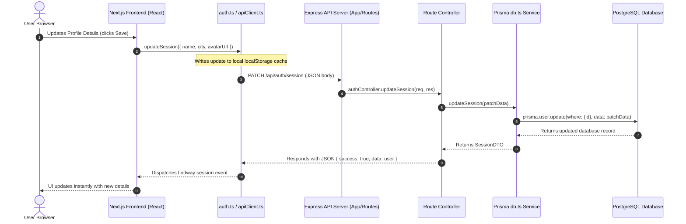
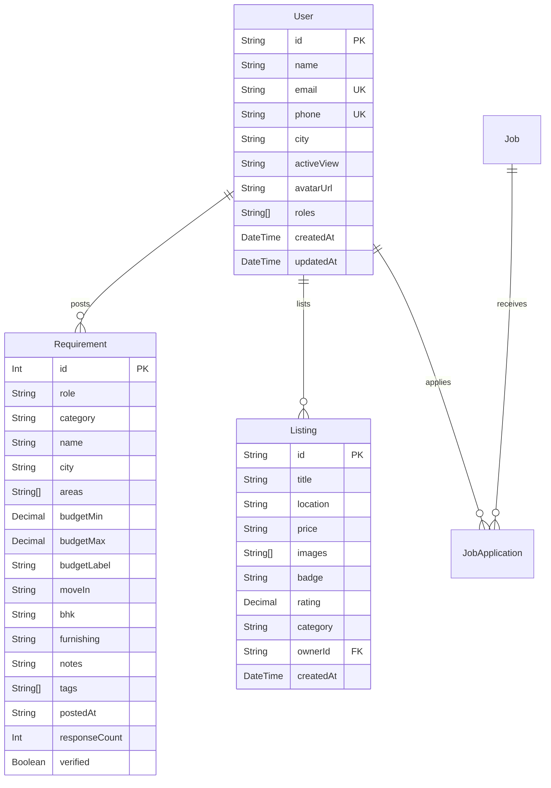

# FindWay — Real Estate & Accommodation Platform

FindWay is a comprehensive real estate platform split into a **Next.js Frontend** and an **Express.js API Backend** powered by a **PostgreSQL** database via **Prisma ORM** and **Supabase Auth**.

---

## 📂 Project Structure & Architecture

```
new manikya_app/
│
├── manikya-backend/              # Express + TypeScript API Server (Port 4000)
│   ├── prisma/
│   │   ├── schema.prisma         # Prisma Schema (PostgreSQL Models)
│   │   └── migrations/           # PostgreSQL Migration history
│   ├── src/
│   │   ├── controllers/          # HTTP request controllers
│   │   ├── routes/
│   │   │   └── api.ts            # Routes configuration
│   │   ├── services/
│   │   │   └── db.ts             # Prisma database client queries
│   │   └── server.ts             # Server listener entry point
│
└── manikya-nest-next/            # Next.js Frontend (Port 3000)
    ├── src/
    │   ├── app/                  # Next.js App Router (Explore, CRM, Profile)
    │   ├── components/           # Reusable UI component libraries
    │   └── lib/
    │       ├── apiClient.ts      # Axios dynamic interceptor client
    │       └── auth.ts           # Authentication session synchronization
```

---

## ⚙️ Getting Started

### 1. Run the Express Backend
Ensure you configure the `.env` database URL variables first inside the `manikya-backend` directory, then run:
```bash
# Apply database migrations
npx prisma migrate dev

# Start development server
npm run dev
```

### 2. Run the Next.js Frontend
Navigate to `manikya-nest-next` and run:
```bash
# Start Next.js development server
npm run dev
```
Open [http://localhost:3000](http://localhost:3000) to view the application in the browser.

---

## 🔄 End-to-End System Data Flow



---

## 📊 Database Relationships (Prisma)


