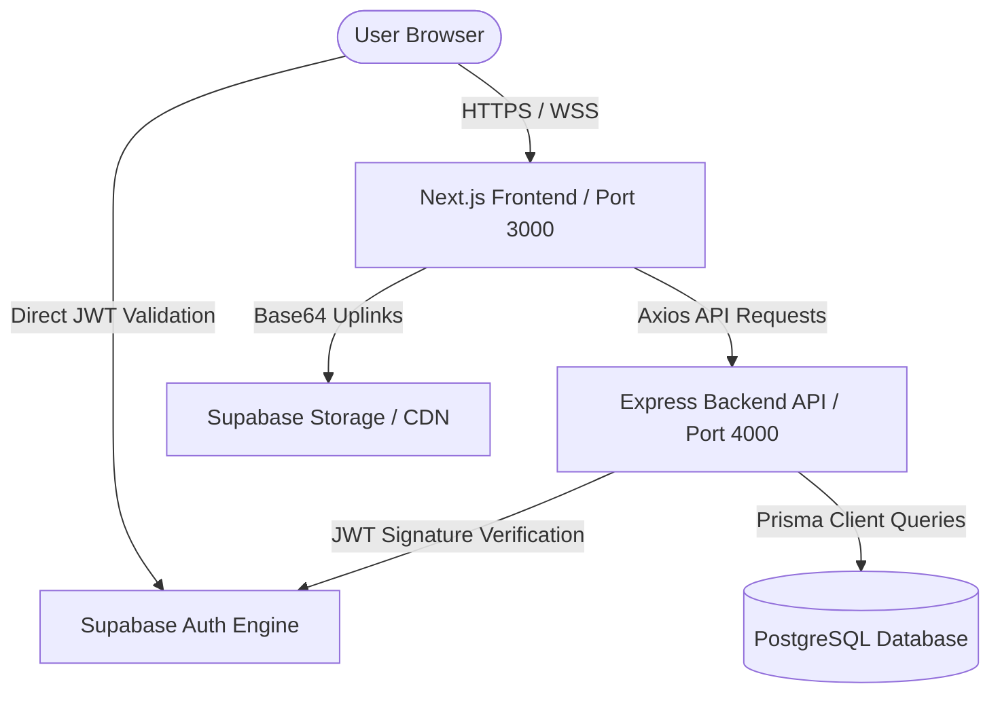
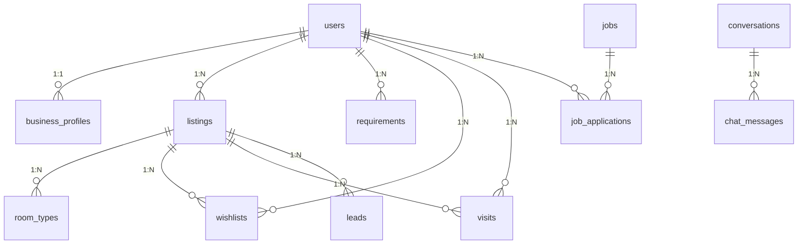

# FindWay — Complete System Design & Architecture

This document presents the complete system architecture, architectural decisions, deployment topology, database design, and end-to-end workflows of the **FindWay** real estate and accommodation platform.

---

## 1. System Context & Topology



* **Frontend Layer:** Next.js (App Router, React server/client components) serving static assets and dynamic pages.
* **API Layer:** Express.js + TypeScript server running behind a reverse proxy (e.g. Nginx) handling business rules, validation, and database orchestration.
* **Database Layer:** PostgreSQL managed instance mapped via Prisma Object-Relational Mapper (ORM).
* **Identity Provider:** Supabase Auth (External OAuth/OTP provider) verifying client identity, generating JWT tokens, and maintaining session state.
* **File Storage:** Supabase Storage buckets or local multi-part media uplinks.

---

## 2. Component Architecture

### A. Next.js Frontend Components
1. **App Router Pages (`/src/app`):**
   * `/explore`: Category exploration page that displays real estate properties, PGs, and commercial spaces.
   * `/post`: A multi-step wizard form to upload property metadata, amenities, photos, and publish listings.
   * `/profile`: Workspace switcher containing both Personal Dashboard (saved properties, active requirements) and Business Dashboard (leads pipeline, analytics, my listings).
   * `/crm`: Agent and builder workbench containing active conversations, scheduled site visits, and leads stages.
2. **State & Auth Mirror (`/src/lib/auth.ts`):**
   * Manages local `localStorage` mirror (`findway.session`) to allow instant UI switches without blocking network requests.
   * Uses React sync mechanisms and custom events (`findway:session`) to broadcast updates.
3. **Axios Client Wrapper (`/src/lib/apiClient.ts`):**
   * Dynamic request interceptor that requests the active Supabase token and attaches it to the HTTP header as `Authorization: Bearer <JWT>`.

### B. Express.js Backend Services
1. **Entry Configuration (`src/server.ts` & `src/app.ts`):**
   * Configures global middleware including CORS (mapping allowed Next.js domains), JSON body size limit extension (for compressed images), and URL encoders.
2. **Auth Middleware (`src/middleware/authMiddleware.ts`):**
   * Validates Supabase JWT signature. Decodes token payloads to inject `req.user` details (id, email, phone) into subsequent middleware scopes.
3. **Services Layer (`src/services/db.ts`):**
   * Implements transaction-safe database logic via Prisma.
   * Maps Prisma database output objects to standardized DTOs (Data Transfer Objects) before responding.

---

## 3. Database Architecture (Entity Layout)



* **`users`**: Central account record. Holds role configurations (tenant, owner, agent, builder) and views.
* **`business_profiles`**: Linked 1:1 to users. Collects license records, coverage zones, and specialities.
* **`listings`**: Houses properties with structured database attributes (bhk, area, furnishing, price_value) ensuring optimal query filters.
* **`room_types`**: Configures multi-tenant sub-rooms (e.g. PG triple sharing beds or hotel suites).
* **`requirements`**: Demand-side feed containing search budgets and move-in dates.
* **`leads`**: Tracks customer pipeline progress (New Lead, Site Visit, Closed) in the agent's CRM.
* **`conversations` & `chat_messages`**: Powers real-time chat between sellers and buyers.

---

## 4. Key Architectural Design Patterns

### A. Client-Side Image Compression Pattern
To prevent network timeouts and high database storage consumption, images are processed in-browser before submission:
```
[Select Image] ➔ [Load into HTML5 Image Object] ➔ [Draw on HTML5 Canvas] ➔ [Scale & Compress Quality] ➔ [Extract base64/blob] ➔ [API Upload]
```

### B. Double-Click Submission Protection (Idempotency Pattern)
Prevents accidental duplicate listing records from rapid UI clicks:
1. **UI Block:** Button switches to loading state and sets a `submitting` React state lock to reject concurrent clicks.
2. **Controller Token Lock:** Backend maintains an active memory Set containing user submission signature hashes (`userId:title:category:price`). Concurrently matching requests are rejected with status `409 Conflict`.

### C. Matching Score Algorithm (Pure Function Pattern)
Uses a deterministic, zero-AI formula to match requirements to listings out of 100 points:
* **Budget Overlap (40%):** Proportional distance score between seeker budget and property pricing.
* **Area Locality (35%):** Keyword matches across preferred areas.
* **Category Match (15%):** Ensures category slugs line up.
* **BHK Match (10%):** Configuration equivalence.
