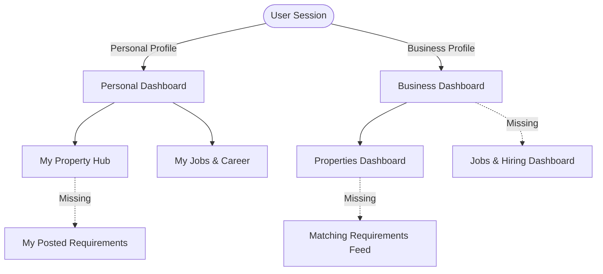

# Dashboard Architecture and Role Mapping

Manikya (NestNext) is a two-sided marketplace operating in two core verticals: **Properties (Nests)** and **Jobs (Next)**. Each vertical serves both **Seekers (Consumers)** and **Providers (Businesses)**. 

To support these different user types, we need a cohesive dashboard strategy that is divided along **Personal (Seeker)** and **Business (Provider)** profiles.

---

## 1. The Core 2x2 Role Matrix

Here is how the platform's users are divided across the two verticals:

| Vertical | Seeker / Consumer (Personal Dashboard) | Provider / Business (Business Dashboard) |
| :--- | :--- | :--- |
| **Properties (Housing)** | **Tenants & Buyers** • Post what they need (Demand-side) • Browse/filter property catalog • Save listings & track scheduled visits | **Landlords, Owners, Sellers, & Agents** • Post property listings (Supply-side) • Review tenant/buyer leads • Browse & respond to seeker requirements |
| **Jobs (Career)** | **Job Seekers & Candidates** • Search & apply to jobs • Upload resumes & edit candidate profiles • Track job applications | **Employers, Recruiters, & Companies** • Post job openings • Review applications & screen resumes • Manage company profile |

---

## 2. Current Implementation Analysis

We analyzed the current codebase and found that the core skeleton for some dashboards is already built in [page.tsx](file:///c:/Users/mahad/OneDrive/Desktop/new%20manikya_app/manikya-nest-next/src/app/profile/page.tsx) and [BusinessDashboard.tsx](file:///c:/Users/mahad/OneDrive/Desktop/new%20manikya_app/manikya-nest-next/src/components/profile/BusinessDashboard.tsx):

### Active Dashboard Roles:
1. **Personal Profile Dashboard** ([page.tsx](file:///c:/Users/mahad/OneDrive/Desktop/new%20manikya_app/manikya-nest-next/src/app/profile/page.tsx)):
   - **My Property Hub**: Handles saved properties, scheduled visits, and flatmate matches.
   - **My Jobs & Career**: Handles job applications, saved jobs, candidate profiles, and courses.
2. **Business Profile Dashboard** ([BusinessDashboard.tsx](file:///c:/Users/mahad/OneDrive/Desktop/new%20manikya_app/manikya-nest-next/src/components/profile/BusinessDashboard.tsx)):
   - **Properties & Real Estate Provider**: Lists properties posted, views leads/enquiries, and tracks listing performance.

---

## 3. What Dashboards are Missing or Need Building?

To complete the full platform experience, we suggest building or expanding the dashboards into the following areas:

### Gap 1: "My Posted Requirements" for Property Seekers (Personal Dashboard)
* **Goal**: When a Tenant or Buyer posts a requirement using the form on [/requirements](file:///c:/Users/mahad/OneDrive/Desktop/new%20manikya_app/manikya-nest-next/src/app/requirements/page.tsx), they need a way to manage it.
* **Key Features**:
  - List of active/archived posted requirements.
  - Responses received from landlords/agents (with contact WhatsApp buttons).
  - Status management (e.g. mark as "Found a place" to pause responses).

### Gap 2: "Matching Requirements & Sent Responses" for Property Providers (Business Dashboard)
* **Goal**: Owners, Sellers, and Agents should be able to view and match with seeker requirements from their dashboard.
* **Key Features**:
  - A tab showing seeker requirements that have a high `matchScore` with the owner's listed properties.
  - History of responses they have sent to seekers and whether the seeker has viewed/responded.

### Gap 3: "Jobs & Hiring (Employer) Dashboard" (Business Dashboard Extension)
* **Goal**: Currently, the business profile only covers properties. If a company logs in, they need a workspace to act as an employer.
* **Key Features**:
  - **My Job Openings**: Create and list job openings (linked to the backend).
  - **Applicant Tracking System (ATS)**: View candidates who applied to their jobs, review their resumes/match status, and change application status (Applied → Shortlisted → Interviewing → Offered/Rejected).
  - **Company Profile**: Edit company details and branding.

---

## 4. Proposed Phased Implementation Plan

Here is how we can help you build this step-by-step:

### Phase 1: Integrate Requirements into Dashboards (Property Verticals)
* **Personal Side**: Add a "My Requirements" section to **My Property Hub** where seekers view their active requirements, responses count, and manage them.
* **Business Side**: Add a "Matching Requirements" feed in the **Business Dashboard** that lists seekers' requirements matching the owner's listings (e.g., matching locations, budgets, BHKs) using the logic in [requirements.ts](file:///c:/Users/mahad/OneDrive/Desktop/new%20manikya_app/manikya-nest-next/src/lib/requirements.ts).

### Phase 2: Create the Jobs & Hiring (Employer) Business Dashboard
* Create a toggle/selection inside the **Business Dashboard** to switch between **Properties** and **Jobs & Hiring** (mirroring the Personal profile segment toggle).
* Implement the job creation form and applicant tracking cards.
* Seed mock applicant data (resumes, experience) so it feels premium and functional out of the box.
