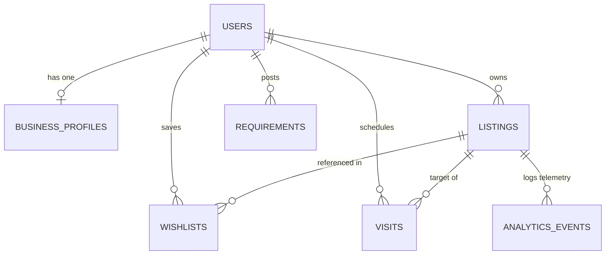

# Backend & Database Architecture Plan for Manikya

This document outlines the database selection, schema design, and backend API routing needed to transition the Manikya app from local mock states to a production-ready persistent backend.

---

## 1. Database Selection: PostgreSQL (Supabase)

We recommend using **PostgreSQL** (with **Supabase** or hosted RDS) for the following reasons:
* **Relational Integrity**: The platform is highly relational (users have profiles, profiles own listings, listings have analytics, users wishlist listings, users schedule visits). 
* **JSONB Capabilities**: Property details vary widely by category (e.g., sharing/meals for PGs vs. seats/carpet area for office spaces). PostgreSQL’s `JSONB` columns allow us to store this unstructured metadata while maintaining database relationships.
* **Match Score Querying**: Complex queries (calculating area overlap and budget overlap) are highly performant when written as PostgreSQL functions/views.

---

## 2. Database Schema Design (Entity-Relationship)

Here is the proposed relational schema:



### 2.1. `users` Table
Stores basic user registration info.
```sql
CREATE TABLE users (
    id UUID PRIMARY KEY DEFAULT gen_random_uuid(),
    name VARCHAR(255) NOT NULL,
    email VARCHAR(255) UNIQUE NOT NULL,
    phone VARCHAR(20) UNIQUE NOT NULL,
    city VARCHAR(100),
    roles VARCHAR(50)[] DEFAULT '{}', -- Array: ['tenant', 'owner', 'agent', 'builder']
    created_at TIMESTAMP WITH TIME ZONE DEFAULT CURRENT_TIMESTAMP,
    updated_at TIMESTAMP WITH TIME ZONE DEFAULT CURRENT_TIMESTAMP
);
```

### 2.2. `business_profiles` Table
Stores professional branding/business information for Agents, Builders, and Owners.
```sql
CREATE TABLE business_profiles (
    id UUID PRIMARY KEY DEFAULT gen_random_uuid(),
    user_id UUID NOT NULL REFERENCES users(id) ON DELETE CASCADE,
    company_name VARCHAR(255),
    logo_url TEXT,
    license_number VARCHAR(100), -- RERA ID
    experience_years INT DEFAULT 0,
    coverage_areas VARCHAR(100)[] DEFAULT '{}', -- Locations they represent
    specialities VARCHAR(100)[] DEFAULT '{}',
    languages VARCHAR(100)[] DEFAULT '{}',
    bio TEXT,
    created_at TIMESTAMP WITH TIME ZONE DEFAULT CURRENT_TIMESTAMP,
    CONSTRAINT unique_user_profile UNIQUE (user_id)
);
```

### 2.3. `listings` Table
Stores properties (supply-side), mapping to [categories.ts](file:///c:/Users/mahad/OneDrive/Desktop/new%20manikya_app/manikya-nest-next/src/lib/categories.ts).
```sql
CREATE TABLE listings (
    id UUID PRIMARY KEY DEFAULT gen_random_uuid(),
    owner_id UUID NOT NULL REFERENCES users(id) ON DELETE CASCADE,
    title VARCHAR(255) NOT NULL,
    category VARCHAR(50) NOT NULL, -- 'rent', 'buy', 'pg', 'commercial-office'
    world VARCHAR(50) NOT NULL, -- 'residential' or 'commercial'
    price NUMERIC(12, 2) NOT NULL,
    location VARCHAR(255) NOT NULL, -- Address
    locality VARCHAR(100) NOT NULL, -- HSR, Indiranagar etc.
    images TEXT[] DEFAULT '{}',
    rating NUMERIC(3, 2) DEFAULT 0.00,
    verified BOOLEAN DEFAULT FALSE,
    no_brokerage BOOLEAN DEFAULT TRUE,
    details JSONB NOT NULL, -- Dynamic details: { bhk, furnishing, occupancy, sharing, meals }
    status VARCHAR(50) DEFAULT 'live', -- 'live', 'paused', 'under_review'
    created_at TIMESTAMP WITH TIME ZONE DEFAULT CURRENT_TIMESTAMP
);
```

### 2.4. `requirements` Table
Stores search demands (demand-side), mapping to [requirements.ts](file:///c:/Users/mahad/OneDrive/Desktop/new%20manikya_app/manikya-nest-next/src/lib/requirements.ts).
```sql
CREATE TABLE requirements (
    id UUID PRIMARY KEY DEFAULT gen_random_uuid(),
    seeker_id UUID NOT NULL REFERENCES users(id) ON DELETE CASCADE,
    role VARCHAR(50) NOT NULL, -- 'tenant', 'buyer'
    category VARCHAR(50),
    budget_min NUMERIC(12, 2) NOT NULL,
    budget_max NUMERIC(12, 2) NOT NULL,
    areas VARCHAR(100)[] NOT NULL, -- Desired localities
    details JSONB, -- bhk, occupancy, move_in, furnishing
    notes TEXT,
    status VARCHAR(50) DEFAULT 'active', -- 'active', 'resolved', 'paused'
    created_at TIMESTAMP WITH TIME ZONE DEFAULT CURRENT_TIMESTAMP
);
```

### 2.5. `wishlists` Table
Tracks user bookmarks for both nests and jobs.
```sql
CREATE TABLE wishlists (
    id UUID PRIMARY KEY DEFAULT gen_random_uuid(),
    user_id UUID NOT NULL REFERENCES users(id) ON DELETE CASCADE,
    listing_id UUID REFERENCES listings(id) ON DELETE CASCADE,
    job_id UUID, -- For future jobs table reference
    created_at TIMESTAMP WITH TIME ZONE DEFAULT CURRENT_TIMESTAMP,
    CONSTRAINT unique_user_bookmark UNIQUE (user_id, listing_id, job_id)
);
```

### 2.6. `visits` Table
Tracks site visits scheduled between seekers and listings.
```sql
CREATE TABLE visits (
    id UUID PRIMARY KEY DEFAULT gen_random_uuid(),
    visitor_id UUID NOT NULL REFERENCES users(id) ON DELETE CASCADE,
    listing_id UUID NOT NULL REFERENCES listings(id) ON DELETE CASCADE,
    visit_time TIMESTAMP WITH TIME ZONE NOT NULL,
    status VARCHAR(50) DEFAULT 'pending', -- 'pending', 'confirmed', 'completed', 'cancelled'
    created_at TIMESTAMP WITH TIME ZONE DEFAULT CURRENT_TIMESTAMP
);
```

### 2.7. `analytics_events` Table
Tracks telemetry for views, likes, and lead clicks.
```sql
CREATE TABLE analytics_events (
    id UUID PRIMARY KEY DEFAULT gen_random_uuid(),
    listing_id UUID NOT NULL REFERENCES listings(id) ON DELETE CASCADE,
    visitor_id UUID REFERENCES users(id) ON DELETE SET NULL, -- Null if guest
    event_type VARCHAR(50) NOT NULL, -- 'view', 'wishlist_add', 'whatsapp_click'
    created_at TIMESTAMP WITH TIME ZONE DEFAULT CURRENT_TIMESTAMP
);
```

---

## 3. Backend API Routing (Express Server)

We will expand [app.ts](file:///c:/Users/mahad/OneDrive/Desktop/new%20manikya_app/manikya-backend/src/app.ts) with dedicated route files:

### 3.1. Auth Route (`/api/auth`)
* `POST /signup`: Create a generic user profile.
* `POST /login`: Log in via email/password or phone OTP.
* `POST /upgrade`: Add business details and enable professional roles (Agent, Builder, Owner).

### 3.2. Listings & Requirements Route (`/api/listings` & `/api/requirements`)
* `GET /listings/search`: Browse listings with filters.
* `POST /listings`: Create a property listing (auth required).
* `POST /requirements`: Post a seeker requirement (auth required).
* `GET /requirements/matches`: Calculate requirements matching an owner's active listings using SQL overlaps.

### 3.3. Dashboards Route (`/api/dashboard`)
* `GET /dashboard/personal`: Fetch saved listings, active requirements, scheduled visits, and job applications.
* `GET /dashboard/business`: Fetch owner listings, active tenant leads, and aggregated analytics metrics:
  ```sql
  -- SQL snippet to aggregate stats for the business dashboard
  SELECT 
      l.id AS listing_id,
      COUNT(CASE WHEN ae.event_type = 'view' THEN 1 END) AS view_count,
      COUNT(CASE WHEN ae.event_type = 'wishlist_add' THEN 1 END) AS like_count,
      COUNT(CASE WHEN ae.event_type = 'whatsapp_click' THEN 1 END) AS lead_count
  FROM listings l
  LEFT JOIN analytics_events ae ON l.id = ae.listing_id
  WHERE l.owner_id = :owner_id
  GROUP BY l.id;
  ```

---

## 4. Frontend Integration Plan

We will replace the mock methods inside:
1. `src/lib/demoAuth.ts` ([demoAuth.ts](file:///c:/Users/mahad/OneDrive/Desktop/new%20manikya_app/manikya-nest-next/src/lib/demoAuth.ts)) -> replace localStorage writes with `fetch()` calls to the backend `/api/auth` endpoints.
2. `src/lib/requirements.ts` ([requirements.ts](file:///c:/Users/mahad/OneDrive/Desktop/new%20manikya_app/manikya-nest-next/src/lib/requirements.ts)) -> replace in-memory matching functions with database query fetches.
3. Dashboards -> fetch active states directly from the server on load.
