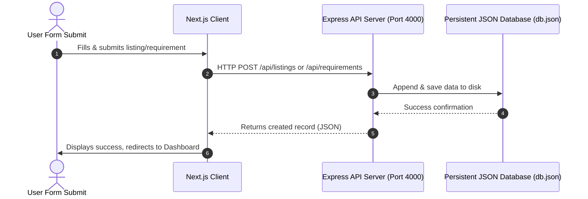

# Implementation Plan: Full-Stack Data Integration (Frontend ↔ Backend ↔ Database)

This plan outlines how we will connect the Manikya (NestNext) frontend to the Express backend, and enable file-based persistence (acting as our database) on the backend. This replaces all in-memory arrays and client-side `localStorage` state with real REST API operations.

---

## 1. Architectural Overview

---

## 2. Proposed Changes

We will implement this across both components of the repository:

### 2.1. Backend Database Persistence & API Endpoints

#### [MODIFY] [mockDb.ts](file:///c:/Users/mahad/OneDrive/Desktop/new%20manikya_app/manikya-backend/src/services/mockDb.ts)
* Update `MockDatabase` to load and save data from/to a local file on the server disk: `manikya-backend/data/db.json`.
* Implement file read/write logic using Node’s `fs` module so data is persistent across server restarts.
* Add mock seed data to `db.json` automatically on first run if the file doesn't exist.
* Expose requirements management functions in the database:
  - `getRequirements()`
  - `addRequirement(req)`
  - `deleteRequirement(id)`

#### [MODIFY] [listingController.ts](file:///c:/Users/mahad/OneDrive/Desktop/new%20manikya_app/manikya-backend/src/controllers/listingController.ts) & [jobController.ts](file:///c:/Users/mahad/OneDrive/Desktop/new%20manikya_app/manikya-backend/src/controllers/jobController.ts)
* Ensure properties submitted from the frontend are parsed, validated, and saved.

#### [NEW] [requirementsController.ts](file:///c:/Users/mahad/OneDrive/Desktop/new%20manikya_app/manikya-backend/src/controllers/requirementsController.ts)
* Create controller to handle `GET /api/requirements`, `POST /api/requirements`, and `DELETE /api/requirements/:id`.

#### [MODIFY] [api.ts](file:///c:/Users/mahad/OneDrive/Desktop/new%20manikya_app/manikya-backend/src/routes/api.ts)
* Register the new requirements endpoints:
  - `GET /api/requirements`
  - `POST /api/requirements`
  - `DELETE /api/requirements/:id`

---

### 2.2. Frontend API Integrations

* **Dependency**: Install `axios` in the Next.js application (`manikya-nest-next`).

#### [NEW] [apiClient.ts](file:///c:/Users/mahad/OneDrive/Desktop/new%20manikya_app/manikya-nest-next/src/lib/apiClient.ts)
* Implement a central axios-based API client for clean REST calls to `http://localhost:4000/api`.

#### [MODIFY] [demoAuth.ts](file:///c:/Users/mahad/OneDrive/Desktop/new%20manikya_app/manikya-nest-next/src/lib/demoAuth.ts)
* Replace localStorage auth actions with calls to the backend's `/api/auth/session` endpoint.

#### [MODIFY] [requirements.ts](file:///c:/Users/mahad/OneDrive/Desktop/new%20manikya_app/manikya-nest-next/src/lib/requirements.ts)
* Replace localStorage requirements actions with `axios` calls to backend `/api/requirements` endpoints.

---

## 3. Verification Plan

### Automated Tests
* Run `cmd /c "npm run dev"` on backend to verify database initialization.
* Run Next.js production build (`cmd /c "npm run build"`) to ensure types compile cleanly.

### Manual Verification Steps
1. Open the browser and list a property on the **List Property** page.
2. Verify the property is written to `manikya-backend/data/db.json` and displays on the exploration feed.
3. Post a requirement, view it in the profile dashboard, and verify it persists when the backend server is stopped and restarted.
