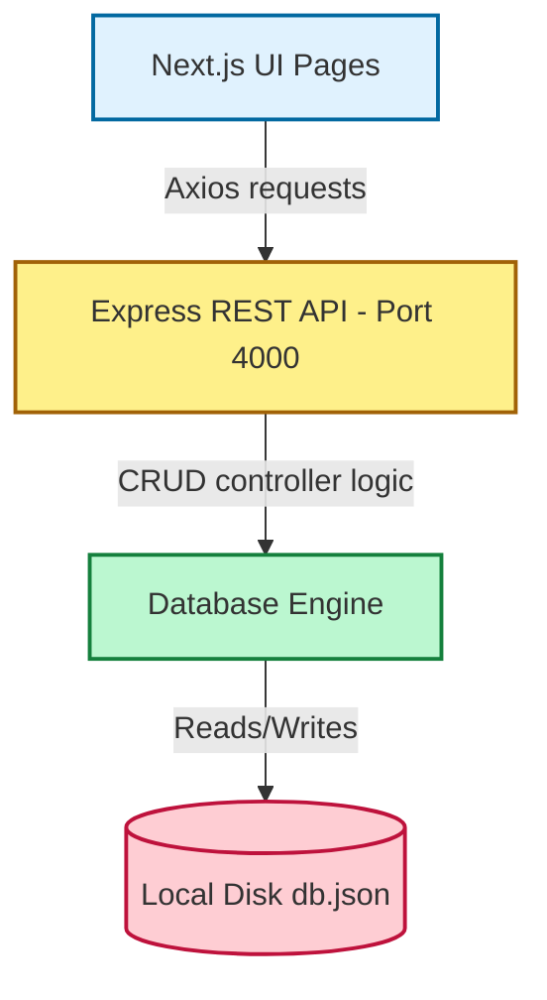
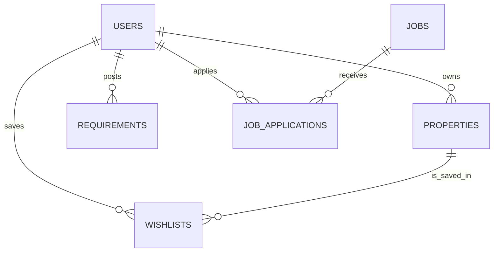

# Project Architecture & Database Wireframe Guide

This document outlines the entire directory structure, data flow, and the database schema wireframe (ER schema) for the Manikya application. Use this design to build your production database tables or collections.

---

## 1. Project Directory Structure

```
new manikya_app/
│
├── manikya-backend/              # Express + TypeScript API Server (Port 4000)
│   ├── data/
│   │   └── db.json               # Current local JSON database file
│   ├── src/
│   │   ├── controllers/          # Request handlers (auth, listings, jobs, requirements)
│   │   ├── routes/
│   │   │   └── api.ts            # REST Route mappings
│   │   ├── services/
│   │   │   └── mockDb.ts         # Persistent data logic using fs
│   │   └── server.ts             # Server configuration & listener
│   └── tsconfig.json
│
└── manikya-nest-next/            # Next.js Frontend (Port 3000)
    ├── docs/dashboards/          # Project reference docs & checklists
    ├── src/
    │   ├── app/                  # Next.js App Router (Page views)
    │   │   ├── find-nest/        # Property search page
    │   │   ├── jobs/             # Job search feed
    │   │   ├── post/             # Property post forms
    │   │   ├── profile/          # Personal & Provider dashboard
    │   │   └── requirements/     # Seeker requirements feed & post form
    │   ├── components/           # Reusable UI widgets
    │   │   └── profile/          # Matching engines & user listings
    │   └── lib/
    │       ├── apiClient.ts      # Axios central backend connector
    │       ├── demoAuth.ts       # Session state client manager
    │       └── requirements.ts   # Seeker requirements matching algorithms
```

---

## 2. Project Data Flow



---

## 3. Database Schema Wireframe (Entity-Relationship)

Here are the recommended fields and tables to implement in your database (e.g. PostgreSQL/MySQL) or collections (MongoDB):



### 3.1. `users` Table
Stores account profiles and roles. Can be configured for buyers, owners, tenants, agents, or builders.

| Field Name | Data Type | Key / Constraint | Description |
| :--- | :--- | :--- | :--- |
| `id` | VARCHAR / UUID | Primary Key | Unique user identifier |
| `name` | VARCHAR(100) | Not Null | User's full name |
| `email` | VARCHAR(150) | Unique, Not Null | User's email |
| `phone` | VARCHAR(15) | Unique, Not Null | 10-digit phone number |
| `city` | VARCHAR(100) | Nullable | Current residential city |
| `roles` | VARCHAR[] / JSON | Not Null | Enabled roles (e.g. `["owner", "tenant"]`) |
| `active_view` | VARCHAR(20) | Default: `'personal'` | Dashboard view switcher (`personal`/`business`) |
| `created_at` | TIMESTAMP | Default: `NOW()` | Timestamp when user registered |

### 3.2. `properties` (Listings) Table
Stores properties listed by owners, builders, or agents for rent, purchase, PG, or commercial use.

| Field Name | Data Type | Key / Constraint | Description |
| :--- | :--- | :--- | :--- |
| `id` | VARCHAR / UUID | Primary Key | Unique listing identifier |
| `owner_id` | VARCHAR / UUID | Foreign Key (`users.id`) | Creator of the listing |
| `title` | VARCHAR(200) | Not Null | Name of the house, PG, or commercial unit |
| `location` | VARCHAR(250) | Not Null | Full address / area name |
| `price` | NUMERIC(12, 2) | Not Null | Monthly rent or sale value |
| `price_label`| VARCHAR(20) | Not Null | e.g., `/mo` or `total` |
| `category` | VARCHAR(50) | Not Null | Taxonomy slug (e.g., `pg`, `rent`, `coliving`, `buy`) |
| `image_url` | VARCHAR(500) | Nullable | Link to representative listing photo |
| `rating` | NUMERIC(2, 1) | Default: `5.0` | Review score out of 5.0 |
| `badge` | VARCHAR(50) | Nullable | e.g. "Premium Choice", "Best Seller" |
| `created_at` | TIMESTAMP | Default: `NOW()` | Listing date |

### 3.3. `requirements` Table
Stores buyer/tenant seeker demands. The business matching engine checks these to notify owners.

| Field Name | Data Type | Key / Constraint | Description |
| :--- | :--- | :--- | :--- |
| `id` | BIGINT / SERIAL| Primary Key | Unique requirement identifier |
| `name` | VARCHAR(100) | Not Null | Submitter's name |
| `role` | VARCHAR(20) | Not Null | Seeker type (`tenant`, `buyer`, `agent`, etc.) |
| `category` | VARCHAR(50) | Nullable | Property category filter |
| `city` | VARCHAR(100) | Not Null | Target city |
| `areas` | VARCHAR[] | Not Null | Target micro-markets / sub-localities |
| `budget_min` | NUMERIC(12, 2) | Not Null | Minimum budget range |
| `budget_max` | NUMERIC(12, 2) | Not Null | Maximum budget range |
| `budget_label`| VARCHAR(30) | Not Null | Pre-formatted range display string |
| `move_in` | VARCHAR(50) | Nullable | e.g., "Immediate", "Within 1 month" |
| `bhk` | VARCHAR(10) | Nullable | e.g., "1 BHK", "2 BHK", "3 BHK" |
| `furnishing` | VARCHAR(30) | Nullable | e.g., "Furnished", "Unfurnished" |
| `notes` | TEXT | Nullable | Extra user description / preferences |
| `tags` | VARCHAR[] | Nullable | Filter pills (e.g., `["AC", "Veg-only"]`) |
| `response_count`| INT | Default: `0` | Number of provider responses received |
| `verified` | BOOLEAN | Default: `false` | Seeker qualification badge indicator |
| `posted_at` | TIMESTAMP | Default: `NOW()` | Timestamp posted |

### 3.4. `jobs` Table
Stores jobs posted by recruiters/companies.

| Field Name | Data Type | Key / Constraint | Description |
| :--- | :--- | :--- | :--- |
| `id` | VARCHAR / UUID | Primary Key | Unique job ID |
| `title` | VARCHAR(150) | Not Null | Job role name |
| `company` | VARCHAR(100) | Not Null | Company name |
| `location` | VARCHAR(150) | Not Null | Job location details |
| `salary` | VARCHAR(50) | Nullable | Salary compensation bracket |
| `logo` | VARCHAR(10) | Nullable | Logo character representation |
| `category` | VARCHAR(50) | Not Null | e.g. `development`, `design`, `support` |

### 3.5. `job_applications` Table
Links users to the jobs they have applied for.

| Field Name | Data Type | Key / Constraint | Description |
| :--- | :--- | :--- | :--- |
| `id` | BIGINT / SERIAL| Primary Key | Unique application ID |
| `user_id` | VARCHAR / UUID | Foreign Key (`users.id`) | Submitting user |
| `job_id` | VARCHAR / UUID | Foreign Key (`jobs.id`) | Applied job |
| `applied_at` | TIMESTAMP | Default: `NOW()` | Application date |

### 3.6. `wishlists` (Saves) Table
Tracks saved properties or nests per seeker account.

| Field Name | Data Type | Key / Constraint | Description |
| :--- | :--- | :--- | :--- |
| `id` | BIGINT / SERIAL| Primary Key | Unique save ID |
| `user_id` | VARCHAR / UUID | Foreign Key (`users.id`) | User who saved the property |
| `listing_id` | VARCHAR / UUID | Foreign Key (`properties.id`)| Saved property listing |
| `created_at` | TIMESTAMP | Default: `NOW()` | Bookmark date |
